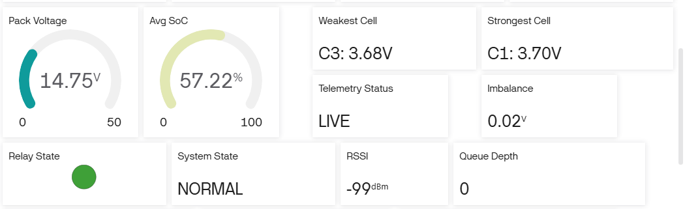
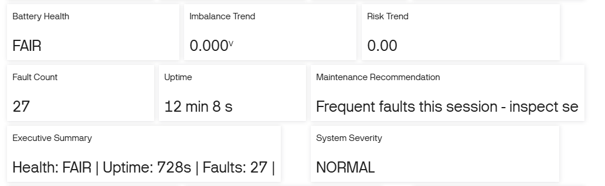

# EV Battery Management System
## Project Overview

The EV Battery Management System (BMS) is an ESP32-based battery monitoring and protection system designed to monitor individual cell voltages, evaluate battery health, detect abnormal operating conditions, and provide real-time system telemetry.
The system calculates key battery parameters such as State of Charge (SoC), cell voltage imbalance, weakest and strongest cells, and imbalance trends. It also implements a non-blocking fault management system with NORMAL, DEGRADED, FAILSAFE, and SHUTDOWN states, along with relay protection, LCD monitoring, offline telemetry queuing, and Blynk-based analytics.
The project is implemented as a modular software architecture so that battery monitoring, fault management, display handling, and telemetry can be maintained and extended independently.

## Key Features

- Real-time monitoring of individual battery cell voltages.
- State of Charge (SoC) estimation and battery imbalance calculation.
- Weakest and strongest cell identification.
- Adaptive imbalance threshold based on battery SoC.
- Increasing, decreasing, and stable imbalance trend detection.
- ADC anomaly detection including frozen, stuck-at-rail, out-of-range, and rapid-change conditions.
- Non-blocking relay protection with hysteresis and debounce.
- Fault state machine with NORMAL, DEGRADED, FAILSAFE, and SHUTDOWN states.
- Flicker-free LCD monitoring with rotating information pages.
- Event-driven telemetry with a fixed-size FIFO offline queue.
- Non-blocking WiFi reconnection and RSSI monitoring.
- Real-time Blynk dashboard for battery and system parameters.
- Battery risk scoring, health assessment, fault history, and maintenance recommendations.
- Fixed-size historical buffer for local trend and analytics calculations.

## System Architecture

## System Workflow

## Fault State Machine

The system uses four safety states to manage battery and system faults:

- **NORMAL** — Normal operating condition
- **DEGRADED** — Fault detected and being monitored
- **FAILSAFE** — Persistent or critical fault requiring protection
- **SHUTDOWN** — Critical safety condition

## Blynk Dashboard & Analytics

The Blynk dashboard provides real-time monitoring of battery and system parameters, including cell voltages, pack voltage, SoC, weakest and strongest cells, imbalance, telemetry status, and system health.

The analytics section provides battery health, risk trends, fault count, uptime, executive summary, system severity, and maintenance recommendations.

## Hardware & Software

| Category | Components / Tools |
|---|---|
| Microcontroller | ESP32 DevKit C |
| Battery Simulation | 4 potentiometers representing battery cell voltages|
| Display | 16×2 I2C LCD |
| Protection | Relay, LEDs, buzzer |
| Connectivity | WiFi, Blynk |
| Simulation | Wokwi |
| Development | PlatformIO, Arduino framework |
| Programming | C++ |
| Libraries | LiquidCrystal_I2C, Blynk |

## Software Structure

- `sketch.cpp` — Main application and system coordination
- `BatteryManager.cpp/.h` — Battery monitoring, SoC, imbalance, and ADC analysis
- `FaultManager.cpp/.h` — Fault detection and safety state machine
- `LCDManager.cpp/.h` — LCD display management
- `TelemetryManager.cpp/.h` — Telemetry, offline queue, and analytics
- `Config.h` — System configuration
- `diagram.json` — Wokwi circuit configuration
- `libraries.txt` — Required libraries
- `wokwi.toml` — PlatformIO/Wokwi configuration

## Wokwi Simulation

The complete BMS is implemented and tested as an ESP32-based Wokwi simulation.

**Wokwi Project:** [Open Wokwi Simulation](https://wokwi.com/projects/474667583514908673)

## Project Status

**Completed and tested**

The project integrates battery monitoring, protection, fault management, LCD visualization, event-driven telemetry, offline queuing, Blynk monitoring, and battery analytics into a single modular BMS implementation.
